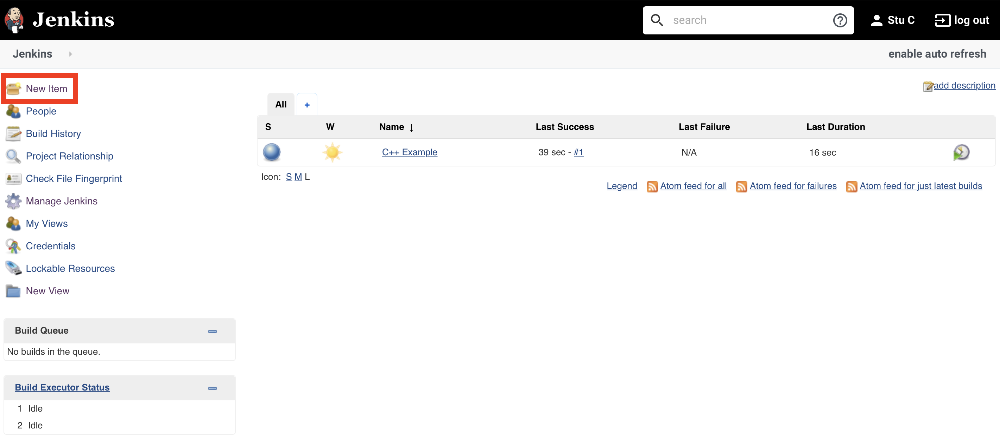

# Jenkins Playground
This repository is to demonstrate skills in Vagrant, Ansible, and Jenkins. It simulates a very simple (and not very secure) build server using Vagrant to supply a Linux Virtual Machine and Ansible to install and configure an HTTP instance of Jenkins and expose it on port 58080 of the host machine.

Whilst it will automatically install Jenkins you will need to follow the post installation steps defined [here](https://www.jenkins.io/doc/book/installing/#setup-wizard) to make use of the server. 

## Artifactory plugin
In order to demonstrate the ability to push build files to an artifact repository the OSS version of Artifactory is also deployed alongside Jenkins. It is exposed on port 58082 of the host machine and will need to be configured as per JFrog's [documentation](https://www.jfrog.com/confluence/display/JFROG/Installing+Artifactory#InstallingArtifactory-Post-InstallSteps). The Jenkins Artifactory plugin should also be installed and configured with the server id set to 'ArtifactoryPlayground'.

## Example pipelines
There are companion code repositories which contain example Jenkins pipelines which can be used with this playground. **All examples rely on the relevant pipeline plugins being installed on the Jenkins server.** 

### C++ 
* https://github.com/stuc2010/hellocplusplus

#### Requirements
* CMake Jenkins plugin
* xUnit Jenkins plugin
* Artifactory plugin

### NodeJS
* TBC

#### Requirements
N/A

### Python
* TBC

#### Requirements
N/A

## Configuring example pipelines
Each of the projects can be added to Jenkins as a 'Pipeline' item. To test these examples create a 'Pipeline' item in Jenkins as per the instructions below.

1. From the Jenkins 'Dashboard' select 'New Item' from the left hand nav menu

2. Enter a name for your 'Pipeline', select 'Pipeline' from the list of item types, and then click 'Ok'

3. Enter a description for your 'Pipeline', select the 'Discard old builds' checkbox, and set the maximum number of builds to keep to 3. *This will keep the disk usage low, even though the projects are quite small*.

4. Under 'Build triggers' select the 'Build periodically' check box and leave blank. *This will mean your build is never triggered but it will still work on demand.*

5. Under 'Pipeline' set your 'Definition' to be 'Pipeline script from SCM'. Then set your 'SCM' to be 'Git', copy the HTTPS clone link for the repo you wish to test, leave all other options as per the default, and save your pipeline

6. You can now test your 'Pipeline' by selecting it from the Jenkins 'Dashboard' and clicking 'Build Now' from the left hand nav menu.

